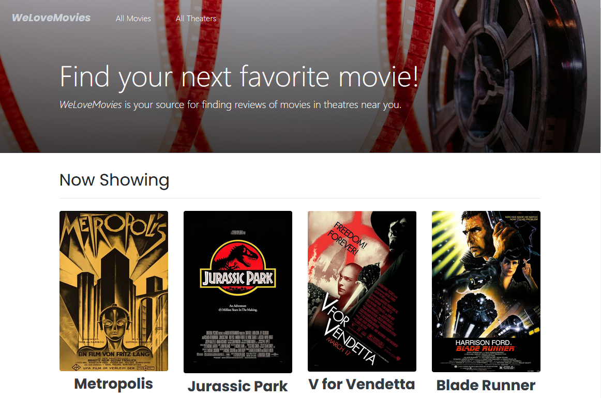

# we-love-movies

WeLoveMovies is the back-end capstone project that I completed during my enrollment at the Chegg Skills (Thinkful) coding bootcamp, which I built using Node.js, Knex.js, and Express.js.

This is the server for the WeLoveMovies front-end [repo](https://github.com/ITbanjo/we-love-movies-frontend.git) provided by Chegg Skills.

## Links

[Deployment](https://we-love-movies-frontend-ofu5.onrender.com) - If the home page does not initially display any content, please allow a minute or two for the back-end to spin up.

## Screenshots

### Home



### Movies


### Movie Details/Reviews


### Theaters


## Install

```sh
npm install
```

## Usage

```sh
npm start
```

## Run tests

```sh
npm test
```
